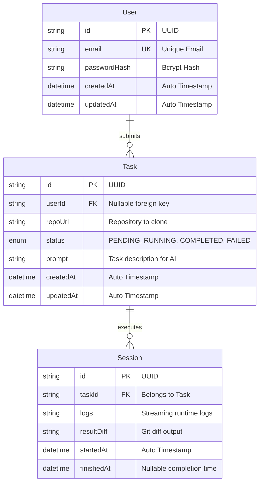

# Coding Harness - Phase-by-Phase Development Documentation

Welcome to the **Coding Harness** development journal! This document records every single feature, architecture decision, file, and command implemented in each phase. It is written to be **100% beginner-friendly**: if you are a newcomer to full-stack TypeScript, Docker, or AI engineering, this guide walks you through the exact concepts, why things were built the way they are, and how to run and test everything.

---

## Table of Contents

- [1. What is Coding Harness?](#1-what-is-coding-harness)
- [2. Phase 1: Foundation & Project Setup](#2-phase-1-foundation--project-setup)
  - [2.1 Core Concepts Explained Simply](#21-core-concepts-explained-simply)
  - [2.2 Project Structure & File Directory](#22-project-structure--file-directory)
  - [2.3 Detailed Breakdown of Built Features](#23-detailed-breakdown-of-built-features)
  - [2.4 Database Architecture & Data Models](#24-database-architecture--data-models)
  - [2.5 Step-by-Step: How to Run the Project](#25-step-by-step-how-to-run-the-project)
  - [2.6 Verifying Endpoints & Health Check](#26-verifying-endpoints--health-check)
- [3. What's Next (Phase 2 Preview)](#3-whats-next-phase-2-preview)

---

## 1. What is Coding Harness?

Standard AI chatbots give you code snippets in text, but they can't actually verify if their code works, compile it, or run unit tests.

**Coding Harness** changes that:

- It acts as an **autonomous software engineer** running in a secure, sandboxed environment.
- You give it a task (e.g. _"Fix bug #42"_ or _"Add an authentication endpoint"_), along with a GitHub repository.
- The system clones the repository, lets the AI inspect files, write code, run real terminal commands (like `npm test` or `pytest`) inside a secure Docker container, inspect errors, fix mistakes automatically, and produce a clean Git diff when all tests pass!

---

## 2. Phase 1: Foundation & Project Setup

### 2.1 Core Concepts Explained Simply

Before jumping into the code, here are the core building blocks used in Phase 1:

| Concept            | What is it?                                                                                                               | Why do we use it here?                                                                                                                   |
| ------------------ | ------------------------------------------------------------------------------------------------------------------------- | ---------------------------------------------------------------------------------------------------------------------------------------- |
| **Monorepo**       | A single Git repository that contains multiple distinct projects or packages (e.g., backend, frontend, and shared types). | Prevents duplicate code. The frontend and backend can share the exact same TypeScript models without publishing to npm.                  |
| **npm Workspaces** | A native feature in Node.js/npm that links sub-folders together automatically.                                            | Allows running commands across packages (e.g., `npm run dev:backend` or building shared code) from the root folder.                      |
| **TypeScript**     | JavaScript with static typing.                                                                                            | Catches bugs at compile time before running the code in production.                                                                      |
| **Express.js**     | A lightweight, flexible web framework for Node.js.                                                                        | Handles HTTP requests, routes, and responses cleanly.                                                                                    |
| **Prisma ORM**     | An Object-Relational Mapper that turns database tables into typed TypeScript code.                                        | Allows interacting with PostgreSQL using clean functions like `prisma.task.findMany()` instead of writing raw SQL strings.               |
| **Docker Compose** | A tool for defining and running multi-container Docker applications via a single YAML file.                               | Lets any developer boot up PostgreSQL and Redis with one command (`docker compose up -d`) without manual installation.                   |
| **Winston**        | A high-performance logging library for Node.js.                                                                           | Replaces basic `console.log` with structured, timestamped, colored logs in development and JSON in production.                           |
| **Helmet & CORS**  | Security middlewares for Express.                                                                                         | `Helmet` sets HTTP security headers to protect against common web attacks. `CORS` controls which websites can communicate with your API. |

---

### 2.2 Project Structure & File Directory

Here is the exact layout of our monorepo after completing Phase 1:

```text
Coding_Harness/
├── .gitignore                     # Prevents sensitive files and dependencies from entering Git
├── .prettierrc                    # Code formatting rules (quotes, spaces, semicolons)
├── .prettierignore                # Files ignored by the code formatter
├── docker-compose.yml             # Local PostgreSQL and Redis database containers
├── package.json                   # Monorepo root configuration and workspace runner
├── MASTER_PLAN.md                 # Complete 6-phase master engineering blueprint
├── PHASE_DOCUMENTATION.md         # This beginner-friendly documentation journal
├── IMPLEMENTATION_PLAN.md         # Detailed technical plan (git-ignored)
├── WALKTHROUGH.md                 # Verification steps and results (git-ignored)
│
├── shared/                        # Shared TypeScript types used across frontend & backend
│   ├── package.json               # Package definition (@coding-harness/shared)
│   ├── tsconfig.json              # TypeScript compilation rules
│   └── src/
│       └── index.ts               # Domain types: User, Task, Session, API envelopes
│
├── backend/                       # Express API server & background orchestration
│   ├── package.json               # Backend dependencies (Express, Prisma, Winston, etc.)
│   ├── tsconfig.json              # TypeScript configuration
│   ├── .env.example               # Template for environment variables
│   ├── .env                       # Active local environment variables
│   ├── prisma/
│   │   └── schema.prisma          # Database schema (PostgreSQL models & relations)
│   └── src/
│       ├── config/
│       │   └── index.ts           # Centralized typed environment variable loader
│       ├── logger/
│       │   └── index.ts           # Winston structured logger configuration
│       ├── db/
│       │   └── client.ts          # Singleton Prisma Client & DB health check utility
│       ├── middlewares/
│       │   ├── requestLogger.ts   # Logs HTTP request method, URL, status & latency
│       │   └── errorHandler.ts    # Centralized error handler and AppError class
│       ├── controllers/
│       │   └── healthController.ts# System diagnostics & health check endpoint handler
│       ├── routes/
│       │   ├── healthRoutes.ts    # Route definitions for /health
│       │   └── index.ts           # Master API router (/api/...)
│       ├── app.ts                 # Express application factory & middleware setup
│       └── server.ts              # Server bootstrap and graceful shutdown handler
│
└── frontend/                      # Placeholder ready for Next.js in Phase 5
    ├── package.json               # Package definition (@coding-harness/frontend)
    └── README.md                  # Overview of future frontend features
```

---

### 2.3 Detailed Breakdown of Built Features

#### 1. Workspace Orchestration (Monorepo Root)

- **Workspaces Configured**: `"shared"`, `"backend"`, and `"frontend"`.
- **Root Helper Scripts**:
  - `npm run dev:backend` — Starts the backend server with hot-reloading using `tsx`.
  - `npm run build` — Compiles the shared package first, then compiles the backend TypeScript code into production JavaScript.
  - `npm run db:generate` — Generates the TypeScript Prisma client from `schema.prisma`.
  - `npm run docker:up` / `docker:down` — Quickly spins up or shuts down Postgres & Redis via Docker.

#### 2. The Shared Types Library (`@coding-harness/shared`)

- In large applications, frontend and backend often get out of sync (e.g. backend renames a field, breaking the frontend).
- We created a dedicated `@coding-harness/shared` workspace that defines single-source-of-truth contracts:
  - `TaskStatus`: Enum for task lifecycle (`PENDING`, `RUNNING`, `COMPLETED`, `FAILED`).
  - `User`, `Task`, `Session`: Canonical interfaces matching the database models.
  - `ApiResponse<T>` & `ApiErrorResponse`: Standardized JSON envelopes for API responses so clients always know what format to expect.
  - `HealthCheckResponse`: Type definition for system diagnostic metrics.

#### 3. Security Middlewares & Hardening

- **Helmet**: Automatically injects standard security headers (Content Security Policy, X-Frame-Options, Strict-Transport-Security) to prevent clickjacking and XSS.
- **CORS**: Configured dynamically via `CORS_ORIGIN` in `.env` to ensure only permitted clients can make API calls.
- **Body Parsers**: Securely parses JSON and URL-encoded HTTP payloads with Express built-ins.

#### 4. Winston Structured Logging

- Replaces basic `console.log` with a production-grade logger:
  - **In Development**: Clean, color-coded, human-readable console output with timestamps and metadata.
  - **In Production**: High-speed JSON formatted logs that can be ingested by Datadog, CloudWatch, or Grafana Loki.
  - **Request Logger Middleware**: Tracks every incoming HTTP request and records the HTTP Method, URL, status code, and latency in milliseconds.

#### 5. Resilient Database Client & Health Checking

- The `prisma` client is exported as a singleton to prevent connection leaks during hot-reloads.
- The `checkDatabaseConnection()` function runs a lightweight ping (`SELECT 1`) with latency measurement.
- If the database is temporarily offline or Docker hasn't booted yet, the server **will not crash**. Instead, it marks itself as `"degraded"` and returns full diagnostics so you know exactly what is wrong.

#### 6. Graceful Server Shutdown

- Handles `SIGINT` (Ctrl+C) and `SIGTERM` signals.
- When you stop the server, it stops accepting new HTTP connections, finishes existing requests, disconnects from the database cleanly, and exits without hanging resources.

---

### 2.4 Database Architecture & Data Models

Defined in `backend/prisma/schema.prisma` for PostgreSQL:



---

### 2.5 Step-by-Step: How to Run the Project

#### Step 1: Install All Dependencies

From the repository root:

```bash
npm install
```

This automatically resolves dependencies for the root, backend, frontend, and shared packages in one go.

#### Step 2: Build the Shared Library

```bash
npm run build:shared
```

This generates the `dist/` directory with TypeScript declarations for all workspaces to consume.

#### Step 3: Generate the Prisma Client

```bash
npm run db:generate
```

This inspects `backend/prisma/schema.prisma` and creates type-safe database queries.

#### Step 4 (Optional): Start PostgreSQL via Docker

If Docker Desktop is running on your machine:

```bash
npm run docker:up
```

This starts PostgreSQL 16 on port `5432` and Redis 7 on port `6379`.

#### Step 5: Start the Backend in Development Mode

```bash
npm run dev:backend
```

You will see:

```text
[2026-09-06 15:36:40] [info]: 🚀 Coding Harness Backend listening on port 4000
[2026-09-06 15:36:40] [info]: 🌐 Environment: development
[2026-09-06 15:36:40] [info]: 🩺 Health check available at: http://localhost:4000/health
```

---

### 2.6 Verifying Endpoints & Health Check

You can test the running server using `curl` or opening it in your browser:

#### Test Health Check:

```bash
curl -s http://localhost:4000/health | jq
```

#### Expected JSON Response:

```json
{
  "success": true,
  "data": {
    "status": "ok",
    "service": "coding-harness-backend",
    "version": "1.0.0",
    "uptimeSeconds": 12,
    "timestamp": "2026-09-06T10:06:40.123Z",
    "environment": "development",
    "database": {
      "connected": true,
      "latencyMs": 3
    },
    "memory": {
      "rss": "42.15 MB",
      "heapTotal": "18.5 MB",
      "heapUsed": "11.2 MB"
    }
  },
  "message": "System healthy",
  "timestamp": "2026-09-06T10:06:40.123Z"
}
```

---

## 3. What's Next (Phase 2 Preview)

With Phase 1 complete, our foundation is solid. Next up is **Phase 2: Core Backend, Git Manager & Queue System**:

- **BullMQ + Redis Job Queue**: Asynchronous task scheduling and worker lifecycle.
- **Git Service**: Safe cloning of repositories to isolated temporary workspaces (`/tmp/workspaces/{taskId}`).
- **User Authentication**: User registration, login, password hashing with `bcrypt`, and JWT token generation.
- **Task REST APIs**: `POST /api/tasks` (submit coding task) and `GET /api/tasks/:id` (fetch status & progress).
